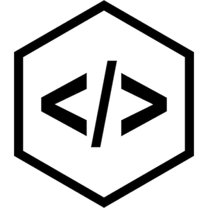

# Udia Client

**Universal Dream | Infinite Awareness**

* The public client can be found at [https://udia.ca](https://udia.ca)

## Quickstart (Development)

To start the client locally:

  * Install dependencies with `yarn install`
  * Run the client with `yarn start`

Now you can visit [`localhost:3001`](http://localhost:3001) from your browser.

## Testing

To test your react app:

  * Run the test with `yarn test`

## License

Udia Software Incorporated (UDIA)

Copyright (c) 2016-2018 Udia Software Incorporated. All Rights Reserved.

Common Public Attribution License Version 1.0 (CPAL)

Full license text can be found at [LICENSE](LICENSE)